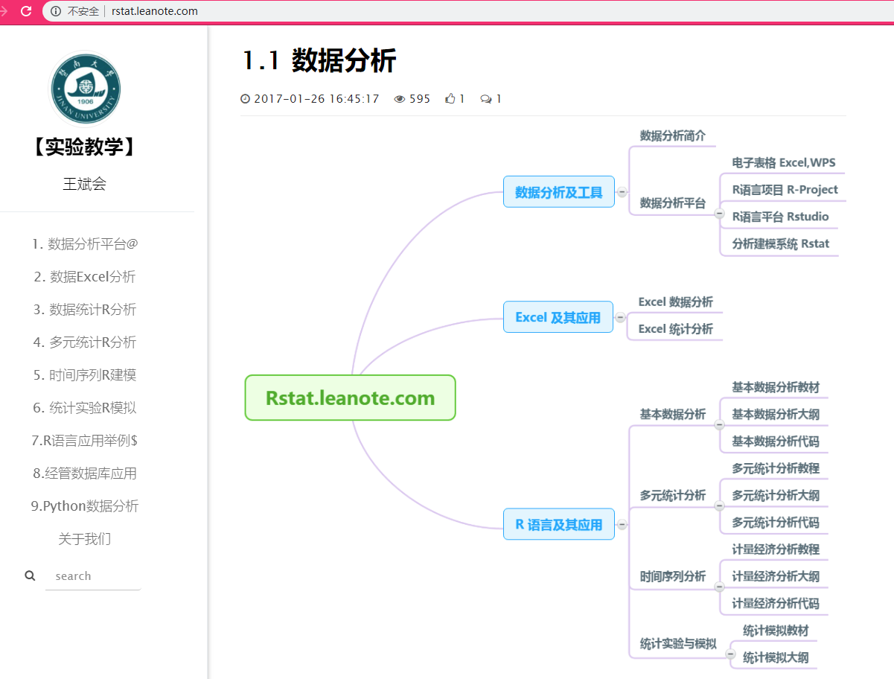
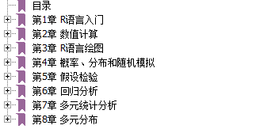

# R-Tutorial-for-Applied-Multivariate-Statistical-Analysis

在多元统计课程上展示的资料

# Reference

## Swirl课程

看书枯燥的时候被安利的，来入门的交互式学习课程，轻松地过一遍R语言，很推荐跟着过一遍。地址在：https://github.com/swirldev/swirl_courses

## 《多元统计分析及R语言建模》暨南大学 王斌会

以案例为线索，手把手教R语言在统计分析的应用，适合每个知识点学完之后上手编程，目录如下：

可以参观王老师的其实验教学平台：http://rstat.leanote.com/

## 《R语言教程草稿》 北京大学 李东风

李东风老师将《R语言教程》的草稿放在其[主页](http://www.math.pku.edu.cn/teachers/lidf/)上，仍还在更新中，内容翔实且紧跟潮流。地址为：http://www.math.pku.edu.cn/teachers/lidf/docs/Rbook/html/_Rbook/

## 《R语言实用教程》 北京工业大学 薛毅

相当于一本R语言字典，附有许多统计知识的讲解以及例子，目录如下：

## 《R语言实战》[美] Robert I. Kabacoff

个人觉得内容比较深奥，豆瓣的评价是：作者高度概括了R语言的强大功能、展示了各种实用的统计示例，而且对于难以用传统方法分析的凌乱、不完整和非正态的数据也给出了完备的处理方法。

## 《R语言编程艺术》[美] Norman Matloff

主要从程序设计的角度上讲解R，从最基本的数据类型和数据结构开始，到闭包、递归和匿名函数等高级主题。
